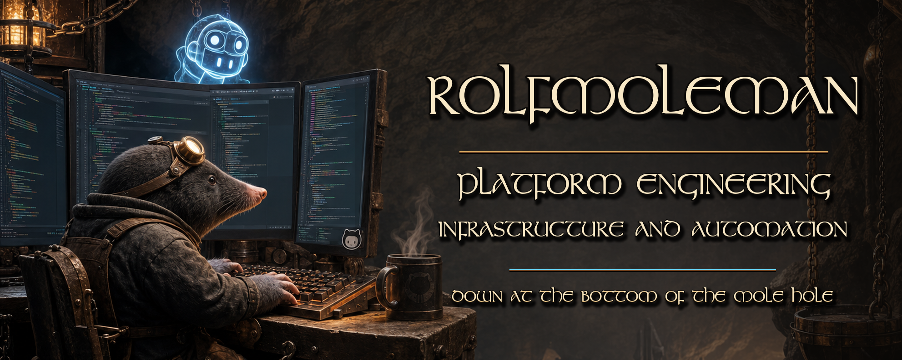

<!-- markdownlint-disable-file MD033 -->

# RolfMoleman branding

The public source of truth for the RolfMoleman visual identity, profile copy and
reusable campaign artwork.

The brand shares the underground workshop, bronze, gold and holographic-blue
visual language of
[Down At The Bottom Of The Mole Hole](https://github.com/DownAtTheBottomOfTheMoleHole),
while keeping the personal profile focused on practical platform engineering.

## About

RolfMoleman is a platform engineer focused on Terraform, PowerShell, Microsoft
Azure and Azure DevOps. The work here centres on reusable infrastructure,
automation, developer tooling and pragmatic engineering quality.

Current areas of interest include:

- reusable Terraform modules and shared platform patterns;
- Azure DevOps extensions and delivery automation;
- MCP tooling for Terraform guidance, MegaLinter and cost insight; and
- developing TypeScript and Python skills alongside Terraform and PowerShell.

## Brand assets

| Asset | Size | Intended use |
| --- | ---: | --- |
| [`rolfmoleman-github.png`](assets/banners/rolfmoleman-github.png) | 1983 × 793 | GitHub profile and repository headers |
| [`rolfmoleman-justgiving-mind.png`](assets/banners/rolfmoleman-justgiving-mind.png) | 1000 × 563 | JustGiving page cover and social sharing |
| [`rolfmoleman-avatar.png`](assets/avatars/rolfmoleman-avatar.png) | 1024 × 1024 | Personal avatar master |
| [`rolfmoleman-mark.png`](assets/logos/rolfmoleman-mark.png) | 1024 × 1024 | Personal crest and square brand mark |

The base artwork is derived from
[`downatthebottomofthemolehole_banner_20.png`](https://github.com/DownAtTheBottomOfTheMoleHole/.github/blob/main/assets/banners/downatthebottomofthemolehole_banner_20.png)
so the personal and organisation identities remain recognisably related.
The avatar and crest are selected from the existing private RolfMoleman artwork
catalogue, giving the public pack a reviewed personal identity rather than
copying the private repository wholesale.

See [the brand guide](BRAND.md) for colours, typography, voice and usage notes.

## Fundraising for Mind

The JustGiving artwork supports the **90 Miles in October** challenge without
presenting itself as official Mind artwork. Ready-to-use page copy is available
in [`docs/justgiving-page-copy.md`](docs/justgiving-page-copy.md).

[Support or share the fundraiser](https://www.justgiving.com/fundraising/rolfmoleman)

## Rebuilding the artwork

The display lettering is rendered with the exact Stonehenge typeface requested
for the brand. The font file is deliberately not stored in this repository.

1. Download `stonehen.ttf` from the
   [Stonehenge page on DaFont](https://www.dafont.com/stonehenge.font).
2. Install the Python dependency:
   `python -m pip install -r requirements-dev.txt`.
3. Render both assets:
   `python tools/render_brand_assets.py --font /path/to/stonehen.ttf`.
4. Validate the committed outputs:
   `python -m unittest discover -s tests`.

The renderer fails if the supplied font is not identified as Stonehenge; it
never silently substitutes another typeface.

## Connect

- [GitHub profile](https://github.com/RolfMoleman)
- [Down At The Bottom Of The Mole Hole](https://github.com/DownAtTheBottomOfTheMoleHole)
- [LinkedIn](https://www.linkedin.com/in/carlrdawson/)

## Asset rights

The banner artwork and its derivatives are proprietary and copyright © 2026
RolfMoleman and Down At The Bottom Of The Mole Hole. They may not be reproduced,
modified, distributed or used in derivative works without prior written
permission.
